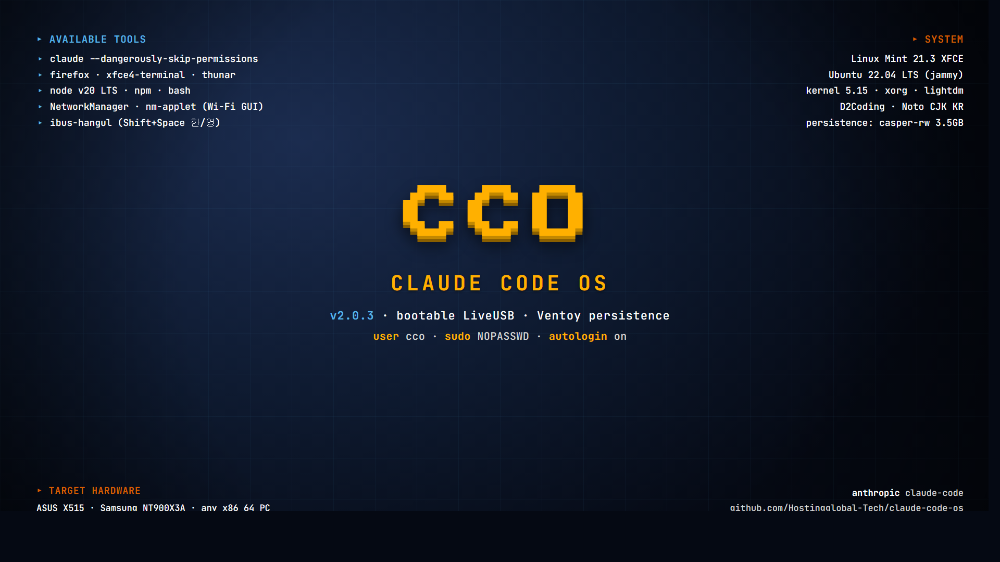

# Claude Code OS (CCO) — LiveUSB



**Claude Code 가 OS 자체** 인 부팅 가능한 LiveUSB ISO 입니다.

USB 한 개 꽂고 부팅하면 — `cco` 사용자 자동 로그인 → XFCE 데스크톱 (Wi-Fi GUI, 한글 입력, Firefox 내장) → xfce4-terminal 자동 시작 → ASCII banner → `claude --dangerously-skip-permissions`. OAuth 한 번이면 끝. 비밀번호 / Wi-Fi / 작업물 전부 Ventoy persistence 로 영구 저장.

> **v2.0** 부터 Linux Mint 21.3 XFCE 기반 (Ubuntu 22.04 LTS). 이전 Alpine v1.0.x 시리즈는 [`archive/alpine-v1/`](archive/alpine-v1/) 참조.

> 📋 [Full changelog](CHANGELOG.md) · [Install guide](INSTALL.md)

**Languages**: [한국어](#한국어) · [English](#english)

---

## 한국어

### 왜 이렇게 만들었나

AI 와 대화 한 번 하려고 — Windows 깔고, 드라이버 잡고, 브라우저 깔고. 또는 Linux 깔고, Node 깔고, `npm install` 하고, 로그인하고. 단계가 너무 많습니다. 컴퓨터 좀 한다는 사람도 헤매고, 모르는 사람한테는 거의 불가능에 가깝습니다.

AI 가 인터페이스 그 자체인데, 왜 그 앞에 OS 와 설치 과정을 끼워두는가. 그래서 OS 자체를 AI 로 만들었습니다.

부팅 → 30초 → 인증 → AI.

### 박힌 항목 (v2.0.3)

- **base**: Linux Mint 21.3 XFCE (Ubuntu 22.04 LTS jammy)
- **claude-code** (npm `@anthropic-ai/claude-code`) + **node v20 LTS**
- **xfce4-terminal** 자동 시작 → claude OAuth
- **firefox** 내장 (OAuth 인증용)
- **NetworkManager + nm-applet** — Wi-Fi GUI 트레이
- **ibus + ibus-hangul** — EN+KO 자동 등록 (`Shift+Space` / `Hangul` 키 토글)
- **fonts**: Noto CJK KR (시스템 11pt), D2Coding 13pt (터미널), JetBrains Mono
- **locale**: ko_KR.UTF-8 + Asia/Seoul timezone
- **lightdm autologin** = `cco` (sudo NOPASSWD)
- **Mint-Y-Dark-Aqua** 테마 + 커스텀 CCO wallpaper (Wong palette colorblind-safe)
- **persistence**: Ventoy `casper-rw` 매핑 → 모든 변경 영구 저장

### 사용법

#### 1. ISO 빌드
사전에 빌드된 ISO 가 [Releases](https://github.com/Hostingglobal-Tech/claude-code-os/releases) 에 없을 경우 (ISO 가 GitHub release 2 GB 한도 초과로 직접 호스팅 안 함) 직접 빌드:

```bash
# 작업 디렉토리에 ISO + branding 준비
mkdir -p ~/cco-build/branding && cd ~/cco-build
# Linux Mint 21.3 XFCE 64bit ISO 다운로드 (https://www.linuxmint.com/edition.php?id=302)
git clone https://github.com/Hostingglobal-Tech/claude-code-os repo
cp repo/build-mint.sh .
cp repo/branding/cco-wallpaper.png branding/

# 빌드 (mksquashfs ~30분, 전체 ~35분)
sudo bash build-mint.sh
# → cco-mint-v2.0.3.iso (~3.4 GB)
```

빌드 의존성: `xorriso`, `unsquashfs`, `mksquashfs` (`squashfs-tools`, `xorriso` 패키지)

#### 2. Ventoy USB 준비
[Ventoy](https://www.ventoy.net/) 으로 USB 포맷 (8 GB+ 권장).

#### 3. ISO + persistence dat 복사
```
F:\cco-mint-v2.0.3.iso       (3.4 GB)
F:\cco-persistence.dat       (3.5 GB, ext4 label=casper-rw)
F:\ventoy\ventoy.json
```

`cco-persistence.dat` 만들기 (Linux):
```bash
dd if=/dev/zero of=cco-persistence.dat bs=1M count=3500
mkfs.ext4 -F -L casper-rw cco-persistence.dat
```

`ventoy.json`:
```json
{
  "control": [
    { "VTOY_DEFAULT_MENU_MODE": "0" },
    { "VTOY_MENU_TIMEOUT": "3" },
    { "VTOY_DEFAULT_IMAGE": "/cco-mint-v2.0.3.iso" }
  ],
  "persistence": [
    {
      "image": "/cco-mint-v2.0.3.iso",
      "backend": "/cco-persistence.dat",
      "autosel": 1
    }
  ]
}
```

#### 4. 부팅
대상 PC 에서 USB 꽂고 → BIOS 부팅 메뉴 (F12 / ESC / F2) → USB 선택 → Ventoy → 3초 후 자동 → 30초 후 claude 프롬프트.

### 동작 확인된 하드웨어
- ASUS X515
- Samsung NT900X3A (Sens 900X 시리즈)
- 일반 x86_64 PC (Intel HD/UHD/AMD GPU + Intel iwlwifi)

### 보안 안내
**샌드박스가 아닙니다.** `claude --dangerously-skip-permissions` 로 root 권한 + 풀 네트워크 권한입니다. 중요한 머신에는 띄우지 마세요. LiveUSB 는 USB 안에서만 데이터 보존되며 호스트 디스크는 건드리지 않습니다.

비밀번호 / Wi-Fi / OAuth 토큰은 **persistence dat 안에만** 저장됩니다. USB 분실 = 데이터 노출. 분실 시 `cco-persistence.dat` 만 삭제하면 초기화됩니다.

---

## English

### Why

Talking to AI takes too many steps — install Windows, drivers, browser. Or install Linux, Node, npm, login. Even tech-savvy people get lost. For non-tech people it's nearly impossible.

AI is the interface — why bolt an OS and install ritual in front of it? So we made the OS itself AI.

Boot → 30 sec → auth → AI.

### What's inside (v2.0.3)

- **base**: Linux Mint 21.3 XFCE (Ubuntu 22.04 LTS jammy)
- **claude-code** (npm `@anthropic-ai/claude-code`) on **Node 20 LTS**
- xfce4-terminal autostart → claude OAuth
- Firefox bundled
- NetworkManager + nm-applet (Wi-Fi tray)
- ibus + ibus-hangul, EN+KO preloaded (`Shift+Space` / `Hangul` key)
- Korean locale (ko_KR.UTF-8) + Asia/Seoul tz
- lightdm autologin (`cco` user, NOPASSWD sudo)
- Mint-Y-Dark-Aqua theme + custom CCO wallpaper (Wong colorblind-safe palette)
- Ventoy `casper-rw` persistence — all changes preserved across reboots

### Build

```bash
mkdir -p ~/cco-build/branding && cd ~/cco-build
# place linuxmint-21.3-xfce-64bit.iso and branding/cco-wallpaper.png here
git clone https://github.com/Hostingglobal-Tech/claude-code-os repo
cp repo/build-mint.sh .
cp repo/branding/cco-wallpaper.png branding/

sudo bash build-mint.sh   # ~35 minutes
# → cco-mint-v2.0.3.iso (~3.4 GB)
```

### Use

Flash USB with [Ventoy](https://www.ventoy.net/), drop the ISO + a 3.5 GB ext4 file labeled `casper-rw` named `cco-persistence.dat`, edit `ventoy/ventoy.json` for default boot + persistence (see Korean section above), boot from USB.

### Tested hardware
ASUS X515 · Samsung NT900X3A · generic x86_64 PCs (Intel HD/UHD/AMD GPU, Intel iwlwifi)

### Security
**Not a sandbox.** `claude --dangerously-skip-permissions` runs as root with full network. Don't run on machines with sensitive data on disk. LiveUSB doesn't touch host disks; all state lives in `cco-persistence.dat` on the USB. Lose the USB = lose secrets. Delete `cco-persistence.dat` to reset.

---

## License
[Apache-2.0](LICENSE)

## Changelog
See [CHANGELOG.md](CHANGELOG.md) (한국어) · [CHANGELOG.en.md](CHANGELOG.en.md) (English)
