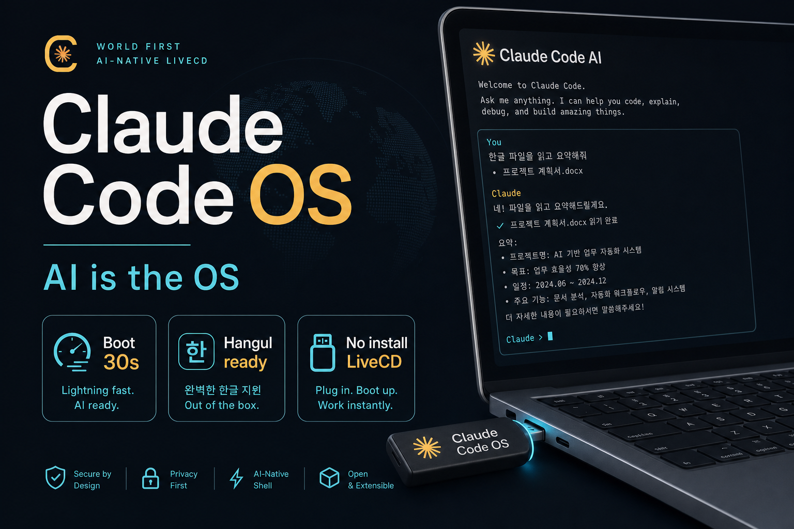

# Claude Code OS (CCO) — LiveCD

**Claude Code 가 OS 자체** 인 부팅 가능한 LiveCD ISO 입니다.

USB 한 개 꽂고 부팅하면 — 자동 로그인 → 데스크톱 → 한글 입력 가능한 터미널 → claude 자동 시작 → OAuth URL 자동으로 Firefox 새 탭에 뜸. 인증 한 번이면 끝.



> Hero image — Claude Code OS v1.0.34. World's first AI-native LiveCD: USB boot → Korean input → AI in 30 seconds.

> 📋 [Full changelog](CHANGELOG.md) · [Install guide](INSTALL.md)

**Languages**: [한국어](#한국어) · [English](#english)

---

## 한국어

### 왜 이렇게 만들었나

AI 와 대화 한 번 하려고 — Windows 깔고, 드라이버 잡고, 브라우저 깔고. 또는 Linux 깔고, Node 깔고, `npm install` 하고, 로그인하고. 단계가 너무 많습니다. 컴퓨터 좀 한다는 사람도 헤매고, 모르는 사람한테는 거의 불가능에 가깝습니다.

AI 가 인터페이스 그 자체인데, 왜 그 앞에 OS 와 설치 과정을 끼워두는가. 그래서 OS 자체를 AI 로 만들었습니다.

부팅 → 15초 → 인증 → AI.

### 이렇게 만들어서 좋은 점

1. **누구나 씁니다.** 컴퓨터 모르는 초보자도, USB 한 개만 꽂고 부팅하면 그 자리에서 AI 와 대화. shell 한 줄, 명령어 한 개 칠 필요 없습니다. 자연어로 시키면 AI 가 알아서 합니다.

2. **OS 설치 단계 자체가 사라집니다.** 디플로이 시간 = 부팅 시간. 설치 매뉴얼도, IT 지원 콜도 필요 없습니다.

3. **버려진 PC, 낡은 노트북, 회의실 PC, 호텔 PC, 카페 PC — 어디든 즉시 AI 워크스테이션이 됩니다.** 디스크에 흔적도 남지 않습니다.

4. **켜자마자 일이 시작됩니다.** 단계 0. 시동에서 작업 사이에 군더더기가 없습니다.

5. **딴 앱으로 새지 않습니다.** 메일, 유튜브, 알림, 광고 — 산만함의 원천이 화면에 존재하지 않습니다. AI 한 가지에만 집중.

6. **키오스크, 교육실, 데모 부스에 그대로 사용할 수 있습니다.** 단일 목적 = 단일 화면. 사용자가 헤맬 여지 자체가 없습니다.

7. **종료하면 깨끗.** 디스크에 아무것도 남지 않습니다. 다음 사람한테 PC 넘겨도 안전.

### 부팅 흐름

```
BIOS POST
  ↓
Alpine Linux 3.20 커널 + initramfs
  ↓
init patch: overlay tar 를 sysroot 위에 풀기
  ↓
switch_root → Node.js + npm + claude-code 가 설치된 실 Alpine 환경
  ↓
inittab 가 tty1 에 root 자동 로그인
  ↓
/etc/profile.d/cco.sh:
    - 배너 표시 (ANSI 256-color cyan/gold)
    - loopback (lo) 활성
    - lo IPv6 활성 (Claude OAuth callback 이 ::1 에 bind)
    - NIC 드라이버 probe (vmxnet3 / e1000)
    - DHCP (udhcpc)
    - sshd 시작
    - exec claude
  ↓
Claude Code 화면이 뜨고, OAuth 코드 입력하면 끝.
```

디스플레이 서버 없음. 윈도우 매니저 없음. 파일 매니저 없음. OS 가 곧 한 프로그램입니다.

### 자동 설치 (한 줄, 추천)

**Windows** (PowerShell, admin):
```powershell
iwr -useb https://raw.githubusercontent.com/Hostingglobal-Tech/claude-code-os/main/install-cco-on-ventoy.ps1 | iex
```

**Linux / macOS**:
```bash
curl -sL https://raw.githubusercontent.com/Hostingglobal-Tech/claude-code-os/main/install-cco-on-ventoy.sh | bash
```

스크립트가:
1. Ventoy USB 자동 검색 (label = `Ventoy`)
2. Latest ISO + persistence.dat + ventoy.json 자동 다운로드 + 설치
3. 부팅하면 3초 후 자동 — Wi-Fi/OAuth/설정 USB 에 자동 저장

**먼저 USB 에 [Ventoy](https://www.ventoy.net) 포함되어 있어야**.

### 수동 다운로드

[Releases](https://github.com/Hostingglobal-Tech/claude-code-os/releases) 에서 4 파일 받음 → USB 의 root + `ventoy/` 에 설치. 상세는 [INSTALL.md](INSTALL.md).

### 직접 빌드

```bash
# 1. Alpine 표준 ISO + minirootfs + squashfs-tools
sudo apt-get install squashfs-tools xorriso cpio   # Debian/Ubuntu
wget https://dl-cdn.alpinelinux.org/alpine/v3.20/releases/x86_64/alpine-standard-3.20.3-x86_64.iso
wget https://dl-cdn.alpinelinux.org/alpine/v3.20/releases/x86_64/alpine-minirootfs-3.20.3-x86_64.tar.gz

# 2. 빌드 (sudo)
sudo ./build-rootfs.sh   # apk + npm + chroot + Wi-Fi/persistence 셋업 → cco-root.squashfs (~760MB, zstd)
sudo ./build-iso.sh 1.0.34   # initramfs patch + boot menu + ISO → cco-alpine-v1.0.34.iso (~930MB)
```

### 실행

**VMware 에서 실행**
```
- 2 vCPU / 4 GB RAM 이상 권장
- 네트워크 어댑터: e1000 또는 vmxnet3
- 부팅 순서: CD/DVD 우선
- ISO 마운트 후 전원 ON
- 약 30~60초 후 데스크톱 + claude 프롬프트
```

**물리 PC 에 USB 로 굽기** (persistence 사용 — 권장)

[Ventoy](https://www.ventoy.net) 으로 USB 박음 → 위의 [자동 설치](#자동-설치-한-줄-추천) 한 줄 명령. Wi-Fi/OAuth/사용자 설정 자동 보존.

**일회용 LiveCD 만 (persistence 없음)**

Rufus / balenaEtcher / `dd` 의 DD 모드는 ISO 를 USB 에 통째로 박아 read-only 가 됨 — **Ventoy/persistence 사용 불가**. 일회용으로만:

```bash
# Linux/macOS
sudo dd if=cco-alpine-vX.Y.Z.iso of=/dev/sdX bs=4M status=progress oflag=sync
```
Windows: Rufus 또는 balenaEtcher 의 DD 모드.

### 기본 로그인 (latest)

```
user: cco         (자동 로그인, sudo NOPASSWD)
pass: cco
root pass: cco    (응급 시만)
```

`cco` 사용자가 데스크톱 + claude 모두 실행. `root` 직접 사용 X (claude 의 `--dangerously-skip-permissions` 가 root 거부).

데모 비번이라 약합니다. 신뢰할 수 없는 네트워크에 SSH 를 열 거라면 부팅 후 `sudo passwd cco` 로 변경하고, `sudo rm /etc/ssh/ssh_host_*; sudo ssh-keygen -A` 로 호스트 키를 새로 만드세요.

### 단축키 (latest)

| 키 | 동작 |
|---|---|
| `F2` | Firefox |
| `F3` | 새 터미널 |
| `F4` | 새 Claude |
| `F11` | Fullscreen |
| `Alt+Mouse1` | 창 이동 |
| `Alt+Mouse3` | 창 크기 조정 |
| `Alt+Tab` | 창 전환 |
| `Ctrl+Shift+V` | 터미널 붙여넣기 |
| 한영 | 한글/영문 토글 |
| 우클릭 (바탕화면) | 메뉴 |

### 이건 이런 게 아닙니다

- 데일리 드라이버 OS 가 아닙니다. GUI, 패키지 매니저 UI, 설치 프로그램 없음.
- 샌드박스가 아닙니다. `claude` 가 root 로 동작하며 네트워크 권한 풀로 가집니다. 중요한 머신에는 띄우지 마세요.
- Anthropic 과 무관합니다. 빌드 시 npm 에서 공식 CLI 를 받아 설치할 뿐입니다.

### 라이선스

MIT. [LICENSE](LICENSE) 참고.

Alpine Linux 베이스는 자체 라이선스 (대부분 MIT/BSD/GPL — Alpine 문서 참고). Claude Code CLI (`@anthropic-ai/claude-code`) 는 Anthropic 의 자체 라이선스. 이 저장소는 빌드 시 npm 에서 받아오는 스크립트만 포함합니다.

---

## English

A bootable LiveCD where **Claude Code is the OS**. Boot from this ISO, and instead of dropping you at a shell, the system logs you in as root, brings up the network, and immediately drops you into `claude`. The terminal is your desktop. The AI is your shell. There is nothing else.

### Why this exists

Talking to an AI shouldn't require installing an OS, then drivers, then a browser, or alternately Linux + Node + npm install + login. Every layer in between is friction. The AI is the interface — so we made the OS *be* the AI. Boot, 15 seconds, OAuth code, done.

### What's good about it

1. **Anyone can use it.** Plug in a USB, boot, and you're talking to an AI in natural language. No shell command, no setup wizard, no IT helpdesk.
2. **OS install step disappears.** Deploy time = boot time. No installation manual, no driver hunt.
3. **Any PC becomes an AI workstation.** Old laptops, conference-room PCs, hotel PCs, café PCs, retired hardware. Nothing is written to the disk.
4. **Work starts the moment power comes on.** No login, no desktop, no app launcher between you and the work.
5. **No distractions.** No mail, no YouTube, no notifications, no ads. The screen has one purpose.
6. **Kiosk-ready, classroom-ready, demo-ready.** One purpose, one screen, no way to get lost.
7. **Clean shutdown.** Disk is untouched, so the next user gets a fresh machine.

### Architecture

```
┌──────────────────────────────────────────────┐
│  Alpine Standard ISO 3.20.3 (upstream)        │
│  └─ /boot/initramfs-lts (patched)             │
│       └─ /init: mount cco-root.squashfs       │
│                 + tmpfs upper + overlayfs     │
│                 → /sysroot (no extraction)    │
│  └─ /cco-root.squashfs (zstd, ~760 MB)        │
│      desktop + Wi-Fi GUI + claude + Korean    │
└──────────────────────────────────────────────┘
```

Two design choices worth calling out:

1. **squashfs + overlayfs.** rootfs is mounted directly as a read-only squashfs; a tmpfs holds writable changes via overlayfs. No extraction step — boot stays fast and the disk is untouched (true LiveCD).

2. **Aggressive device discovery.** The `/init` patch tries 11 mount points, then 13 block devices, then `find /` (depth 6). Works on QEMU, VMware, Ventoy, bare-metal USB.

3. **Ventoy-aware persistence.** Boot-time scan finds `casper-rw` labeled partitions or a `cco-persistence.dat` file inside any FAT32/exFAT partition; bind-mounts `/home/cco`, `/etc/NetworkManager`, `/var/lib/iwd` so Wi-Fi credentials and OAuth tokens survive reboots.

### Download

Grab `cco-alpine-vX.Y.Z.iso` from the [Releases](https://github.com/Hostingglobal-Tech/claude-code-os/releases) page.

### Build it yourself

```bash
sudo apt-get install squashfs-tools xorriso cpio
wget https://dl-cdn.alpinelinux.org/alpine/v3.20/releases/x86_64/alpine-standard-3.20.3-x86_64.iso
wget https://dl-cdn.alpinelinux.org/alpine/v3.20/releases/x86_64/alpine-minirootfs-3.20.3-x86_64.tar.gz
sudo ./build-rootfs.sh        # → cco-root.squashfs
sudo ./build-iso.sh 1.0.34    # → cco-alpine-v1.0.34.iso
```

### Run

**VMware**
- 2 vCPU / 4 GB RAM (recommended)
- Network adapter: e1000 or vmxnet3
- Boot order: CD/DVD first
- ~30–60s after power-on, you'll see the desktop + claude prompt.

**USB on bare metal** (persistence — recommended)

Install [Ventoy](https://www.ventoy.net) on your USB, then run the [one-line auto installer](#download). Wi-Fi/OAuth/user settings are preserved across reboots.

**LiveCD only (no persistence)**

Rufus / balenaEtcher / `dd` writes the ISO as a raw image — the USB becomes read-only and **Ventoy/persistence is not possible**. For single-session use only:

```bash
# Linux/macOS
sudo dd if=cco-alpine-vX.Y.Z.iso of=/dev/sdX bs=4M status=progress oflag=sync
```
Windows: Rufus or balenaEtcher in DD mode.

### Default credentials (latest)

```
user: cco         (autologin, sudo NOPASSWD)
pass: cco
root pass: cco    (emergency only)
```

`cco` runs the desktop and claude. `root` is not used directly — claude's `--dangerously-skip-permissions` rejects root.

Demo password — change it (`sudo passwd cco`) and regenerate SSH host keys (`sudo rm /etc/ssh/ssh_host_*; sudo ssh-keygen -A`) before exposing on an untrusted network.

### Keyboard shortcuts (latest)

| Key | Action |
|---|---|
| `F2` | Firefox |
| `F3` | New terminal |
| `F4` | New Claude |
| `F11` | Fullscreen |
| `Alt+Mouse1` | Move window |
| `Alt+Mouse3` | Resize window |
| `Alt+Tab` | Switch window |
| `Ctrl+Shift+V` | Paste in terminal |
| Hangul key | Korean/English toggle |
| Right-click on desktop | Menu |

### What it is not

- Not a daily-driver OS. No GUI, no installer, no package manager UI.
- Not a sandbox. `claude` runs as root with full network access — don't run it on a machine you care about.
- Not affiliated with Anthropic. We just install their official CLI from npm at build time.

### License

MIT. See [LICENSE](LICENSE). Alpine Linux base is under its own licenses (mostly MIT/BSD/GPL). The Claude Code CLI (`@anthropic-ai/claude-code`) is licensed by Anthropic; this repo only contains build scripts that fetch it from npm.

