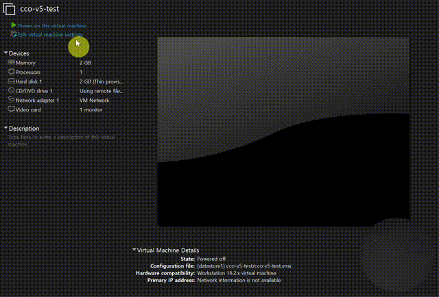

# Claude Code OS (CCO) — LiveCD

A bootable LiveCD where **Claude Code is the OS**.

Boot from this ISO, and instead of dropping you at a shell, the system logs you in as root, brings up the network, and immediately drops you into `claude`. The terminal is your desktop. The AI is your shell. There is nothing else.



> ▶ Full-quality boot recording: [demo/boot.mp4](demo/boot.mp4) · Single frame: [demo/screenshot.png](demo/screenshot.png)

## What it does

```
BIOS POST
  ↓
Alpine Linux 3.20 kernel + initramfs
  ↓
init patch: extract overlay tar onto sysroot
  ↓
switch_root → real Alpine userland with Node.js + npm + claude-code installed
  ↓
inittab autologin on tty1 as root
  ↓
/etc/profile.d/cco.sh:
    - banner (ANSI 256-color cyan/gold)
    - bring up loopback (lo)
    - enable IPv6 on lo (Claude OAuth callback needs ::1)
    - probe NIC drivers (vmxnet3 / e1000)
    - DHCP via udhcpc
    - start sshd
    - exec claude
  ↓
You see Claude Code, type your OAuth code, and you are in.
```

No display server. No window manager. No file manager. The OS is one program.

## Architecture

```
┌──────────────────────────────────────────────┐
│  Alpine Standard ISO 3.20.3 (upstream, vanilla)│
│  └─ /boot/initramfs-lts (patched)             │
│       └─ /init: extract /cco-root.tar.gz onto│
│                 /sysroot before switch_root  │
│  └─ /cco-root.tar.gz (we add this — the rootfs│
│      built by chroot installing nodejs + npm  │
│      + @anthropic-ai/claude-code globally)    │
└──────────────────────────────────────────────┘
```

Two design choices worth calling out:

1. **No squashfs.** Earlier iterations mounted a squashfs overlay at init time, but loop module wasn't loaded that early. busybox `tar` is always available, so the rootfs ships as a plain `.tar.gz` and we extract it directly onto `/sysroot/`. Slightly larger, but bulletproof.

2. **No apkovl auto-detect.** Alpine's standard apkovl mechanism wants to find the overlay via syslinux APPEND args, and that path was unreliable across QEMU/VMware/bare-metal. We bypass it by patching `/init` to find the tar at any of `/media/cdrom`, `/media/sr0`, `/.modloop`, `/sysroot/media/cdrom`, with a `find /` fallback.

## Build

You need a Linux build host (or WSL) with:

- `bash`, `sudo`, `tar`, `cpio`, `gzip`, `xorriso`
- Internet (for `apk` and `npm install`)
- Disk: ~2 GB free

```bash
# 1. Get the upstream Alpine ISO once
wget https://dl-cdn.alpinelinux.org/alpine/v3.20/releases/x86_64/alpine-standard-3.20.3-x86_64.iso

# 2. Get a minirootfs tarball
wget https://dl-cdn.alpinelinux.org/alpine/v3.20/releases/x86_64/alpine-minirootfs-3.20.3-x86_64.tar.gz \
  -O alpine-minirootfs.tar.gz

# 3. Build (asks for sudo password once)
sudo ./build-rootfs.sh    # apk add + npm install + chroot fixups → cco-root.tar.gz
sudo ./build-iso.sh       # patches initramfs, repackages ISO → cco-livecd.iso

# 4. Boot it
qemu-system-x86_64 -m 2048 -cdrom cco-livecd.iso -boot d
```

## Run on VMware

```
- 2 vCPU / 2 GB RAM minimum
- Network adapter: e1000 or vmxnet3 (both work — drivers auto-probed)
- Boot order: CD/DVD first
- Mount cco-livecd.iso, power on
- After ~15 seconds you should see the banner + claude prompt
```

## Default credentials

The image ships with a deliberately weak demo password:

```
user: root
pass: cco
```

This is a LiveCD for tinkering. If you want to expose SSH on a network you don't trust, change the root password (`passwd`) and regenerate the SSH host keys (`rm /etc/ssh/ssh_host_*; ssh-keygen -A`) on first boot.

## What it is not

- Not a daily driver OS. There is no GUI, no package manager UI, no installer. The disk is read-only.
- Not a sandbox. `claude` runs as root with full network access. Don't run it on a machine you care about.
- Not affiliated with Anthropic. This image just happens to install their official CLI from npm.

## License

MIT. See [LICENSE](LICENSE).

The Alpine Linux base is under its own license (mostly MIT/BSD/GPL — see Alpine's docs). The Claude Code CLI (`@anthropic-ai/claude-code`) is licensed by Anthropic under their own terms; this repo only ships build scripts that fetch it from npm at build time.
